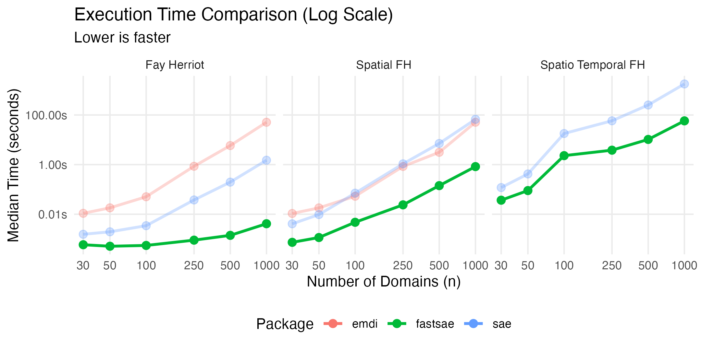
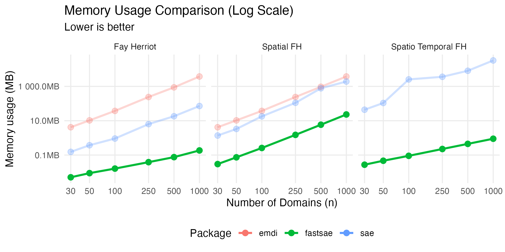

# fastsae: Fast Small Area Estimation in R

<!-- badges: start -->

[](https://CRAN.R-project.org/package=fastsae)
[](https://github.com/ridsonap/fastsae/actions/workflows/R-CMD-check.yaml)
[](https://www.gnu.org/licenses/gpl-3.0)

<!-- badges: end -->

## Overview

**fastsae** is a high-performance R package for **Small Area Estimation
(SAE)**. It re-engineers classic and modern SAE models using **C++ (via
Rcpp and RcppArmadillo)** and **OpenMP multi-threading**, providing
massive speedups (up to **10,000x+**) and radical memory reductions (up
to **20,000x**) compared to existing packages like **sae** and **emdi**.

Most importantly, **fastsae** produces **exact numerical equivalence**
with the gold-standard implementations in the **sae** package (Molina &
Rao), ensuring that your statistical conclusions remain 100% faithful to
the published literature while executing in a fraction of a second.

Documentation : <https://ridsonap.github.io/fastsae/>

### Key Features

- ⚡ **Blazing Fast**: Core Fisher-scoring algorithms and iterative
  solvers run in compiled C++, reducing computation time from minutes to
  milliseconds.
- 🎯 **Exact Numerical Equivalence**: Point estimates ($\hat{\beta}$,
  $\hat{\theta}$) and variance components ($\hat{\sigma}_u^2$,
  $\hat{\rho}$) are numerically identical to **sae**.
- 🧵 **Multi-Threaded Bootstrap**: Native OpenMP parallelization for
  Parametric and Non-Parametric Bootstrap MSE estimation.
- 🗺️ **Automatic Handling of Unsampled Domains**: Spatial Fay-Herriot
  (`eblup_sfh`) automatically handles domains with missing responses
  (`y = NA`) via full-spatial synthetic (kriging) prediction.
- 💾 **Minimal Memory Footprint**: Avoids large $O(m^2)$ and $O(m^3)$
  memory allocations, enabling scaling to thousands of areas without
  memory exhaustion.
- 📊 **Modern S3 Interface**: Full support for standard R idioms:
  `summary()`, `coef()`, `fitted()`, `residuals()`, and `autoplot()`.

------------------------------------------------------------------------

## Supported Models

| Model | Function | Random Effect Structure | MSE Estimation Methods |
|:---|:---|:---|:---|
| **Fay-Herriot** (Area-level) | `eblup_fh()` | Independent area effects ($u_d \sim N(0, \sigma_u^2)$) | Analytical (Prasad-Rao) |
| **Spatial Fay-Herriot** | `eblup_sfh()` | Simultaneous Autoregressive (SAR(1)) | Analytical, Parametric Bootstrap (`pbmse`), Non-Parametric Bootstrap (`npbmse`) |
| **Spatio-Temporal Fay-Herriot** | `eblup_stfh()` | Spatial SAR(1) + Temporal AR(1) | Parametric Bootstrap (`pbmse`) |
| **Battese-Harter-Fuller** (Unit-level) | `eblup_bhf()` | Random intercept nested in domains | Parametric Bootstrap (`pbmse`) |

------------------------------------------------------------------------

## Exact Numerical Equivalence with `sae`

Although **fastsae** runs orders of magnitude faster, its statistical
estimates are **identical to machine precision** with the benchmark
**sae** package:

``` r
library(fastsae)
library(sae)

# 1. Standard Fay-Herriot Model
mys_df <- as.data.frame(na.omit(mys))
fit_fast <- eblup_fh(y ~ x1 + x2 + x3, vardir = ~vardir, data = mys_df, print_result = FALSE)
fit_sae  <- sae::eblupFH(y ~ x1 + x2 + x3, vardir = vardir, data = mys_df)

all.equal(fit_fast$df_eblup$eblup, as.vector(fit_sae$eblup))      
# TRUE
all.equal(as.vector(coef(fit_fast)), as.vector(fit_sae$fit$estcoef$beta))
# TRUE
all.equal(fit_fast$random_effect_var, fit_sae$fit$refvar)          
# TRUE

# 2. Spatial Fay-Herriot Model (SAR)
W_clean <- mys_proxmat[!is.na(mys$y), !is.na(mys$y)]
sfh_fast <- eblup_sfh(y ~ x1 + x2 + x3, vardir = ~vardir, W = W_clean, data = mys_df, print_result = FALSE)
sfh_sae  <- sae::eblupSFH(y ~ x1 + x2 + x3, vardir = vardir, proxmat = W_clean, data = mys_df)

all.equal(sfh_fast$df_eblup$eblup, as.vector(sfh_sae$eblup))       
# TRUE
all.equal(sfh_fast$rho, sfh_sae$fit$spatialcorr)                    
# TRUE
all.equal(sfh_fast$random_effect_var, sfh_sae$fit$refvar)           
# TRUE
```

------------------------------------------------------------------------

## Comparison with Other Packages

| Feature | `fastsae` | `sae` (Molina & Rao) | `emdi` (Kreutzmann et al.) |
|:---|:--:|:--:|:--:|
| **Core Computation** | **C++ (RcppArmadillo)** | Pure R | R / lme4 / nlme |
| **Multi-Threading** | **Native OpenMP** (`n_threads`) | Single-threaded | Optional foreach/parallel |
| **Numerical Consistency** | **Reference baseline** | Baseline | Approximations |
| **Unsampled Area Support** | **Automatic (Spatial Kriging)** | Manual subsetting required | Limited |
| **Bootstrap Speed** | **Ultra-Fast (Parallel C++)** | Slow (R loops) | Moderate |
| **RAM Consumption** | **Minimal (\< 10 MB)** | Moderate (\~100 MB) | High (\~800+ MB) |
| **S3 Methods Support** | `print`, `summary`, `coef`, `fitted`, `residuals`, `autoplot` | Custom lists | Standard S3 |

### Performance Benchmark Summary

Benchmark performed across area sizes ranging from $n = 30$ to
$n = 1,000$ (with 5 covariates):

| Metric | `fastsae` | `sae` | `emdi` |
|:---|:--:|:--:|:--:|
| **Mean Time (EBLUP FH)** | **0.0015 s** | 0.291 s | 9.64 s |
| **Mean Time (Spatial FH)** | **0.165 s** | 12.60 s | 8.69 s |
| **Mean Time (Spatio Temporal FH)** | **12.5 s** | 353.0 s | \- |
| **Peak Memory (EBLUP FH)** | **0.055 MB** | 16.3 MB | 824 MB |
| **Peak Memory (Spatial FH)** | **5.15 MB** | 408 MB | 824 MB |
| **Peak Memory (Spatio Temporal FH)** | **0.289 MB** | 7822 MB | \- |
| **Speedup at n = 1,000** | **Baseline** | **\~364x slower** | **\~12,300x slower** |





------------------------------------------------------------------------

## Installation

You can install the development version from GitHub:

``` r
# install.packages("remotes")
remotes::install_github("ridsonap/fastsae")
# or cran version
install.packages('fastsae')
```

------------------------------------------------------------------------

## Quick Start Examples

### 1. Standard Fay-Herriot Model (`eblup_fh`)

``` r
library(fastsae)

# Fit area-level Fay-Herriot with REML
fit_fh <- eblup_fh(
  y ~ x1 + x2 + x3,
  vardir = ~vardir,
  data = na.omit(mys),
  method = "REML"
)

# View estimates and regression coefficients
summary(fit_fh)
coef(fit_fh)
head(fitted(fit_fh))
```

### 2. Spatial Fay-Herriot with Parallel Bootstrap MSE (`eblup_sfh`)

When domains have geographic proximity, `eblup_sfh` incorporates a
spatial weight matrix $W$ and supports multi-threaded Parametric
Bootstrap MSE:

``` r
# Fit Spatial Fay-Herriot with 4 OpenMP threads and Parametric Bootstrap MSE
fit_sfh <- eblup_sfh(
  y ~ x1 + x2 + x3,
  vardir = ~vardir,
  data = mys,
  W = mys_proxmat,
  mse_method = "pbmse",
  B = 200,
  n_threads = 4,
  seed = 123
)

# Unsampled domains (y = NA) are automatically predicted via spatial kriging!
head(fit_sfh$df_eblup)
```

### 3. Spatio-Temporal Fay-Herriot Model (`eblup_stfh`)

For panel data observed over multiple time periods, `eblup_stfh` models
simultaneous spatial correlation (SAR) and temporal autoregression
(AR(1)):

``` r
# Prepare panel data
panel_data <- mys_panel[!is.na(mys_panel$y) & mys_panel$year >= 2024, ]
W_sub <- mys_proxmat[-c(21, 25), -c(21, 25)]

fit_stfh <- eblup_stfh(
  y ~ x1 + x2 + x3,
  data = panel_data,
  vardir = ~vardir,
  domain = ~area,
  time = ~year,
  W = W_sub,
  model = "ST",
  compute_mse = TRUE,
  B = 100,
  seed = 42
)

head(fit_stfh$df_eblup)
```

### 4. Unit-Level Battese-Harter-Fuller Model (`eblup_bhf`)

For survey datasets containing individual/unit observations:

``` r
# Prepare population auxiliary means
df_pop <- cornsoybeanmeans
names(df_pop)[names(df_pop) == "MeanCornPixPerSeg"] <- "CornPix"
names(df_pop)[names(df_pop) == "MeanSoyBeansPixPerSeg"] <- "SoyBeansPix"
names(df_pop)[names(df_pop) == "CountyIndex"] <- "County"

fit_bhf <- eblup_bhf(
  CornHec ~ CornPix + SoyBeansPix,
  unit_data = cornsoybean,
  Xpop = df_pop,
  domain_var = "County",
  popsize_var = "PopnSegments",
  mse = TRUE,
  B = 50,
  seed = 123
)

summary(fit_bhf)
head(fit_bhf$df_eblup)
```

### 5. Diagnostics and Visualization (`autoplot`)

`fastsae` provides convenient ggplot2-based diagnostic and comparison
visualizations via `autoplot()`:

``` r
# 1. EBLUP estimates vs direct survey estimates with 45° reference line
autoplot(fit_fh, type = "estimates")

# 2. Mean Squared Error (MSE) comparison across domains
autoplot(fit_fh, type = "mse")

# 3. Multi-model comparison across domains (e.g., FH vs Spatial FH)
autoplot(list("FH" = fit_fh, "Spatial FH" = fit_sfh), type = "comparison")
```

------------------------------------------------------------------------

## References

- Fay, R. E., & Herriot, R. A. (1979). Estimates of income for small
  places: An application of James-Stein procedures to Census data.
  *Journal of the American Statistical Association*, 74(366), 269–277.
- Battese, G. E., Harter, R. M., & Fuller, W. A. (1988). An
  error-components model for prediction of county crop areas using
  survey and satellite data. *Journal of the American Statistical
  Association*, 83(401), 28–36.
- Marhuenda, Y., Molina, I., & Morales, D. (2013). Small area estimation
  with spatio-temporal Fay-Herriot models. *Computational Statistics &
  Data Analysis*, 58, 308–325.
- Pratesi, M., & Salvati, N. (2008). Small area estimation for spatially
  correlated data: A Fay-Herriot with the spatial linear spline model.
  *Journal of Applied Statistics*, 35(7), 781–794.
- Rao, J. N. K., & Molina, I. (2015). *Small Area Estimation* (2nd ed.).
  John Wiley & Sons.
