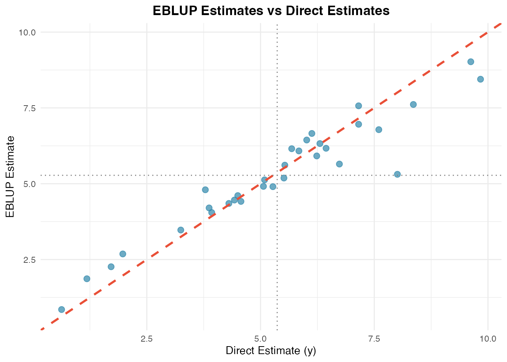
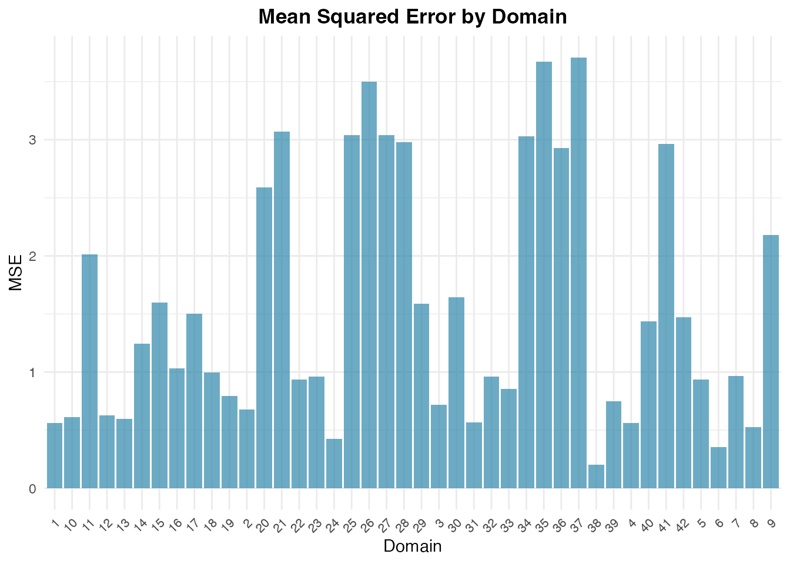

# Getting Started with fastsae

## Introduction

Small Area Estimation (SAE) encompasses statistical techniques designed
to produce reliable estimates for sub-populations or geographical
domains where sample sizes are too small for direct survey estimators to
achieve acceptable precision.

The **fastsae** package provides high-performance C++ implementations
(via `Rcpp` and `RcppArmadillo`) for standard and advanced SAE models.
It offers:

- **Ultra-fast computation**: Fisher-scoring and numerical solvers
  compiled in C++.
- **Exact numerical equivalence**: Parameter estimates and variance
  components match gold-standard implementations in the `sae` package to
  machine precision.
- **Modern S3 interface**: Seamless integration with standard R methods
  ([`summary()`](https://rdrr.io/r/base/summary.html),
  [`coef()`](https://rdrr.io/r/stats/coef.html),
  [`fitted()`](https://rdrr.io/r/stats/fitted.values.html),
  [`residuals()`](https://rdrr.io/r/stats/residuals.html),
  [`autoplot()`](https://ggplot2.tidyverse.org/reference/autoplot.html)).

## The Fay-Herriot Model

The area-level model introduced by Fay and Herriot (1979) links direct
survey estimators $`y_d`$ with auxiliary variables $`x_d`$:

``` math
y_d = x_d^\top \beta + u_d + e_d, \quad d = 1, \dots, D
```

where: - $`u_d \sim \text{i.i.d. } N(0, \sigma_u^2)`$ represents
domain-specific random effects. - $`e_d \sim \text{ind. } N(0, D_d)`$
represents sampling errors with known sampling variance $`D_d`$
(`vardir`).

The Empirical Best Linear Unbiased Predictor (EBLUP) is a weighted
combination of the direct estimator and the regression-synthetic
estimator:

``` math
\hat{\theta}_d = \gamma_d y_d + (1 - \gamma_d) x_d^\top \hat{\beta}
```

where $`\gamma_d = \frac{\hat{\sigma}_u^2}{\hat{\sigma}_u^2 + D_d}`$ is
the shrinkage factor ($`0 \le \gamma_d \le 1`$).

## Step-by-Step Example

### 1. Load Package and Dataset

We use the built-in `mys` dataset (mean years of schooling):

\
[`library`](https://rdrr.io/r/base/library.html)`(`[`fastsae`](https://ridsonap.github.io/fastsae)`)`\
[`library`](https://rdrr.io/r/base/library.html)`(`[`ggplot2`](https://ggplot2.tidyverse.org)`)`\
\
[`data`](https://rdrr.io/r/utils/data.html)`(``"mys"``)`\
[`head`](https://rdrr.io/r/utils/head.html)`(``mys``)`\
`#> ``# A tibble: 6 × 9`\
`#>    area     y vardir   rse    x1    x2    x3      n  weight`\
`#>   ``<int>`` ``<dbl>``  ``<dbl>`` ``<dbl>`` ``<dbl>`` ``<dbl>`` ``<dbl>``  ``<dbl>``   ``<dbl>`\
`#> ``1``     1  8.36  0.662  9.73   124    24    14  ``7``280. 0.032``6`` `\
`#> ``2``     2  7.60  0.837 12.0     89    18     9  ``2``743. 0.012``3`` `\
`#> ``3``     3  5.51  0.882 17.0     57    19     5  ``1``706. 0.007``64`\
`#> ``4``     4  3.87  0.658 21.0     88    35    19  ``3``073. 0.013``8`` `\
`#> ``5``     5  6.31  1.28  17.9    141    46    29 ``13``400. 0.060``0`` `\
`#> ``6``     6  3.93  0.388 15.9     96    29    10  ``2``004. 0.008``97`

### 2. Fit Fay-Herriot Model (`eblup_fh`)

To fit an area-level Fay-Herriot model using Restricted Maximum
Likelihood (REML):

\
`# Fit Fay-Herriot model`\
`fit_fh`` ``<-`` `[`eblup_fh`](https://ridsonap.github.io/fastsae/reference/eblup_fh.md)`(`\
`  formula ``=`` ``y`` ``~`` ``x1`` ``+`` ``x2`` ``+`` ``x3``,`\
`  vardir  ``=`` ``~``vardir``,`\
`  data    ``=`` ``mys``,`\
`  method  ``=`` ``"REML"``,`\
`  print_result ``=`` ``FALSE`\
`)`

### 3. Model Summary and Coefficients

The standard S3 [`summary()`](https://rdrr.io/r/base/summary.html)
method provides comprehensive model diagnostics, variance components,
and coefficient tests:

\
[`summary`](https://rdrr.io/r/base/summary.html)`(``fit_fh``)`\
`#> `\
`#> ``──`` ``Summary of fastsae Fit`` ``──────────────────────────────────────────────────────`\
`#> Call :`\
`#> eblup_fh(formula = y ~ x1 + x2 + x3, vardir = ~vardir, data = mys, method =`\
`#> "REML", print_result = FALSE)`\
`#> `\
`#> ``✔`` Convergence: Yes (in 6 iterations)`\
`#> ``Model``: Fay-Herriot (Area-level)`\
`#> ``Method``: eblup`\
`#> `\
`#> Variance Components:`\
`#> sigma2_u: 2.608103 `\
`#> `\
`#> Coefficients:`\
`#>                   beta  std.error     zvalue pvalue`\
`#> (Intercept)  3.1077510  0.7697687  4.0372527 0.0001`\
`#> x1          -0.0019323  0.0098886 -0.1954019 0.8451`\
`#> x2           0.0555184  0.0614129  0.9040187 0.3660`\
`#> x3           0.0335344  0.0580013  0.5781663 0.5632`\
`#> `\
`#> Goodness of Fit:`\
`#> loglikelihood           AIC           BIC `\
`#>     -65.14251     140.28502     147.61370 `\
`#> `\
`#> EBLUP Summary Statistics:`\
`#>      eblup             mse              rse        `\
`#>  Min.   :0.8506   Min.   :0.2037   Min.   : 9.844  `\
`#>  1st Qu.:4.1973   1st Qu.:0.6886   1st Qu.:14.889  `\
`#>  Median :5.0196   Median :1.0156   Median :22.157  `\
`#>  Mean   :5.0746   Mean   :1.5434   Mean   :26.275  `\
`#>  3rd Qu.:6.1360   3rd Qu.:2.4886   3rd Qu.:35.020  `\
`#>  Max.   :9.0220   Max.   :3.7074   Max.   :53.065`

You can extract fixed-effects coefficients using
[`coef()`](https://rdrr.io/r/stats/coef.html):

\
[`coef`](https://rdrr.io/r/stats/coef.html)`(``fit_fh``)`\
`#>  (Intercept)           x1           x2           x3 `\
`#>  3.107750953 -0.001932259  0.055518370  0.033534410`

Fitted EBLUP estimates and residuals can be extracted using standard
generics:

\
`# Fitted values (EBLUP)`\
[`head`](https://rdrr.io/r/utils/head.html)`(`[`fitted`](https://rdrr.io/r/stats/fitted.values.html)`(``fit_fh``)``)`\
`#> [1] 7.612738 6.782316 5.187060 4.201545 6.323679 4.048590`\
\
`# Residuals (direct estimate - EBLUP)`\
[`head`](https://rdrr.io/r/utils/head.html)`(`[`residuals`](https://rdrr.io/r/stats/residuals.html)`(``fit_fh``)``)`\
`#> [1]  0.74678890  0.81733383  0.32707611 -0.33221827 -0.01861583 -0.12178363`

### 4. Diagnostic Plots (`autoplot`)

`fastsae` extends
[`ggplot2::autoplot()`](https://ggplot2.tidyverse.org/reference/autoplot.html)
to provide convenient diagnostic and comparison plots.

#### Direct Estimates vs EBLUP

Comparing the direct estimates against EBLUP demonstrates shrinkage
towards the regression synthetic line:

\
[`autoplot`](https://ggplot2.tidyverse.org/reference/autoplot.html)`(``fit_fh``, type ``=`` ``"estimates"``)`



#### Mean Squared Error (MSE) Across Domains

Inspect domain-level uncertainty with MSE plots:

\
[`autoplot`](https://ggplot2.tidyverse.org/reference/autoplot.html)`(``fit_fh``, type ``=`` ``"mse"``)`



## Exact Numerical Equivalence with `sae`

`fastsae` produces results that are mathematically identical to
[`sae::eblupFH`](https://rdrr.io/pkg/sae/man/eblupFH.html):

\
`if`` ``(`[`requireNamespace`](https://rdrr.io/r/base/ns-load.html)`(``"sae"``, quietly ``=`` ``TRUE``)``)`` ``{`\
`  ``mys_clean`` ``<-`` `[`as.data.frame`](https://rdrr.io/r/base/as.data.frame.html)`(`[`na.omit`](https://rdrr.io/r/stats/na.fail.html)`(``mys``)``)`\
`  ``fit_fast`` ``<-`` `[`eblup_fh`](https://ridsonap.github.io/fastsae/reference/eblup_fh.md)`(``y`` ``~`` ``x1`` ``+`` ``x2`` ``+`` ``x3``, vardir ``=`` ``~``vardir``, data ``=`` ``mys_clean``, print_result ``=`` ``FALSE``)`\
`  ``fit_sae``  ``<-`` ``sae``::`[`eblupFH`](https://rdrr.io/pkg/sae/man/eblupFH.html)`(``y`` ``~`` ``x1`` ``+`` ``x2`` ``+`` ``x3``, vardir ``=`` ``vardir``, data ``=`` ``mys_clean``)`\
\
`  ``# Check EBLUP estimates`\
`  `[`all.equal`](https://rdrr.io/r/base/all.equal.html)`(``fit_fast``$``df_eblup``$``eblup``, `[`as.vector`](https://rdrr.io/r/base/vector.html)`(``fit_sae``$``eblup``)``)`\
\
`  ``# Check regression coefficients`\
`  `[`all.equal`](https://rdrr.io/r/base/all.equal.html)`(`[`as.vector`](https://rdrr.io/r/base/vector.html)`(`[`coef`](https://rdrr.io/r/stats/coef.html)`(``fit_fast``)``)``, `[`as.vector`](https://rdrr.io/r/base/vector.html)`(``fit_sae``$``fit``$``estcoef``$``beta``)``)`\
\
`  ``# Check random effect variance (sigma2_u)`\
`  `[`all.equal`](https://rdrr.io/r/base/all.equal.html)`(``fit_fast``$``random_effect_var``, ``fit_sae``$``fit``$``refvar``)`\
`}`\
`#> [1] TRUE`

## References

- Fay, R. E., & Herriot, R. A. (1979). Estimates of income for small
  places: An application of James-Stein procedures to Census data.
  *Journal of the American Statistical Association*, 74(366), 269–277.
- Rao, J. N. K., & Molina, I. (2015). *Small Area Estimation* (2nd ed.).
  John Wiley & Sons.
