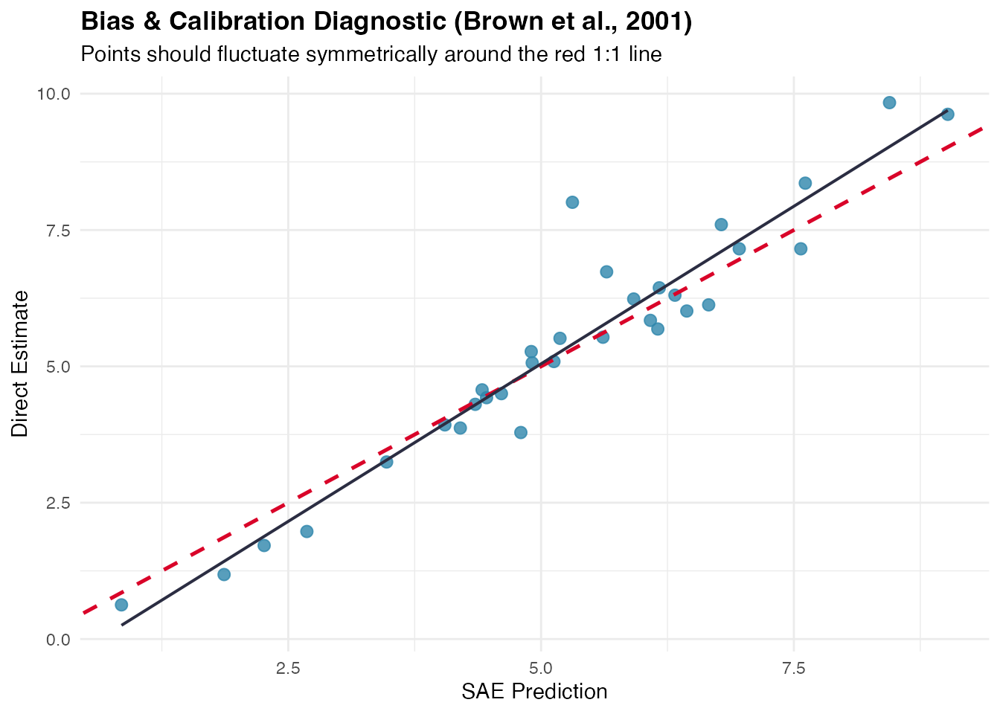
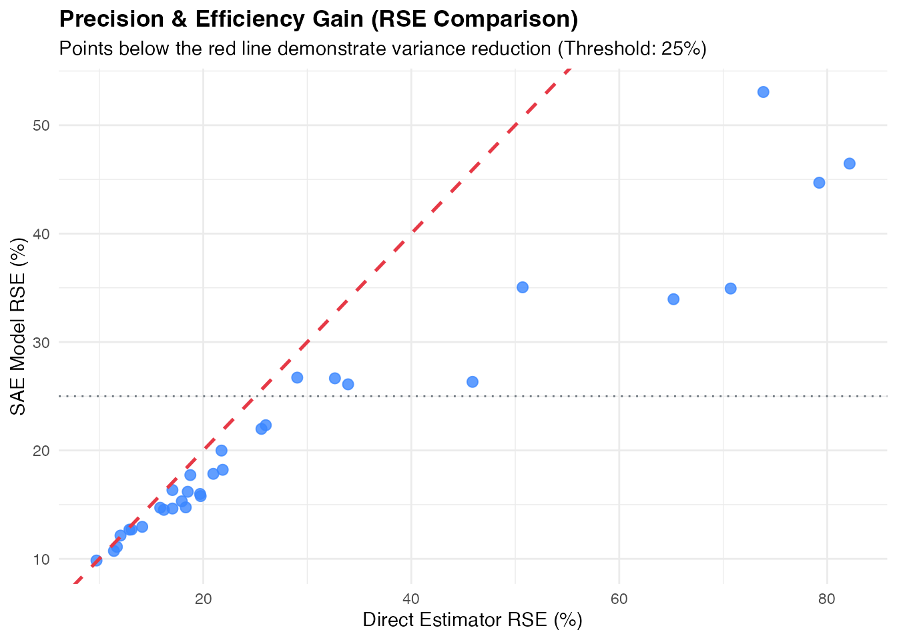
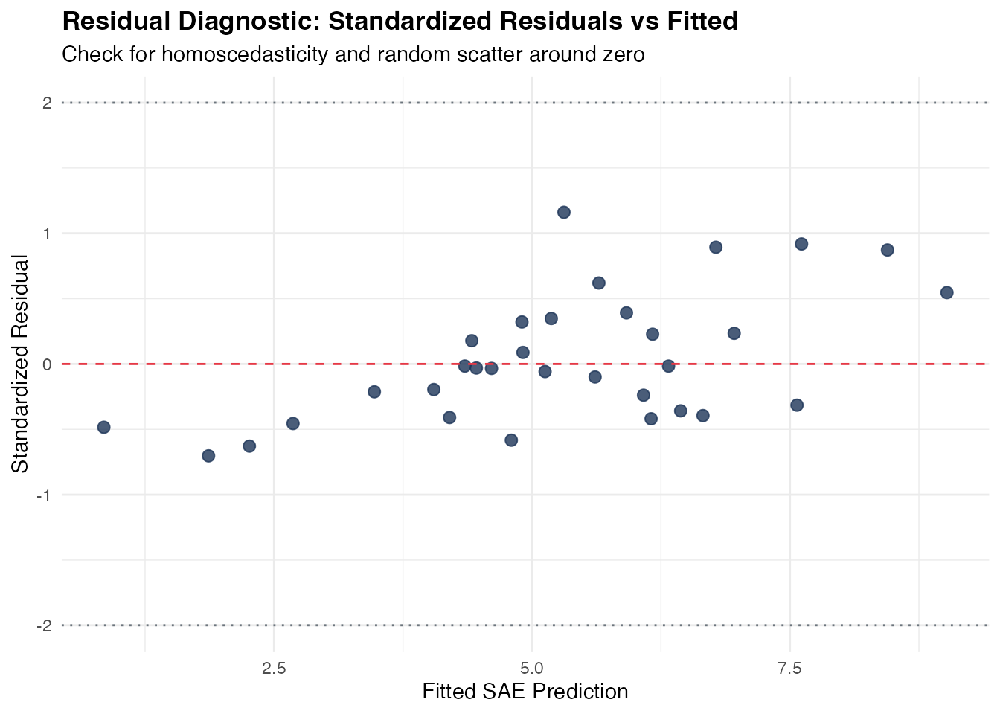
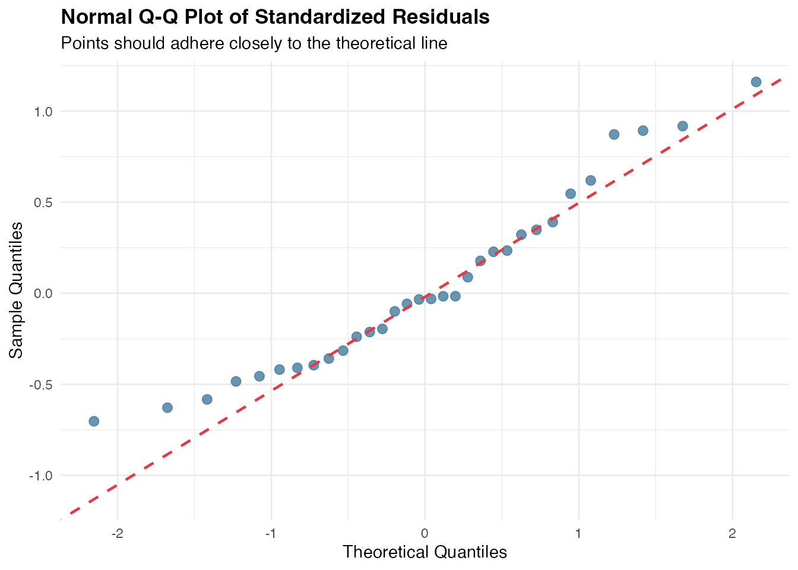
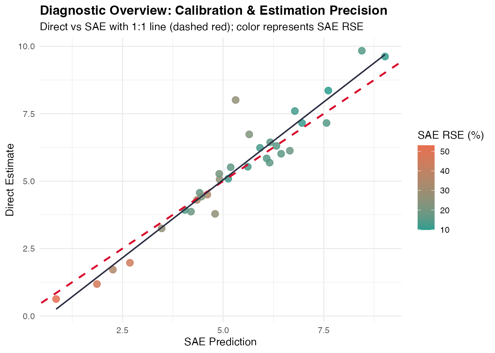

# Model Diagnostics and Residual Analysis

## Introduction

In Small Area Estimation (SAE), model-based estimators borrow strength
across domains and time to improve estimation precision over direct
survey estimators. However, introducing model assumptions carries the
risk of model misspecification, bias, and inappropriate shrinkage.

To address these challenges, **fastsae** provides a unified diagnostic
framework centered on the
[`diagnose()`](https://ridsonap.github.io/fastsae/reference/diagnose.md)
function and its dedicated S3
[`autoplot()`](https://ggplot2.tidyverse.org/reference/autoplot.html)
visualization method. It evaluates both **frequentist C++ EBLUP** models
(`eblup_fh`, `eblup_sfh`, `eblup_stfh`, `eblup_bhf`) and **Bayesian INLA
EBP** models (`ebp_area`).

------------------------------------------------------------------------

## Core Diagnostic Criteria

The diagnostic workflow evaluates four fundamental dimensions of SAE
model quality:

1.  **Precision Gain & RSE Reduction**: Quantifies the improvement in
    Relative Standard Error
    ($`\text{RSE} = \frac{\sqrt{\text{MSE}}}{\hat{\theta}} \times 100\%`$)
    compared to direct survey estimates. Evaluates whether areas satisfy
    the official statistics reliability threshold (typically
    $`\text{RSE} < 25\%`$ or $`20\%`$).
2.  **External Calibration & Bias Diagnostic (Brown et al., 2001)**:
    Tests whether model predictions are statistically unbiased
    predictors of direct estimates using the regression:
    ``` math
    y_d = \alpha + \beta \hat{\theta}_d + e_d
    ```
    Under unbiasedness, the joint hypothesis
    $`H_0: \alpha = 0, \beta = 1`$ should not be rejected.
3.  **Goodness-of-Fit Statistic**: Computes the Chi-square diagnostic
    statistic $`W`$:
    ``` math
    W = \sum_{d=1}^D \frac{(y_d - \hat{\theta}_d)^2}{V_d + \text{MSE}(\hat{\theta}_d)}
    ```
    which approximately follows a $`\chi^2(D)`$ distribution under the
    null hypothesis of proper model specification.
4.  **Residual Spatial Autocorrelation (Moran’s I)**: Verifies whether
    spatial autocorrelation has been fully captured by the model random
    effects. Significant residual spatial clustering indicates that
    unmodeled spatial patterns remain.

------------------------------------------------------------------------

## Practical Example: Diagnosing a Fay-Herriot Model

We demonstrate the diagnostic workflow using the built-in `mys` dataset
(Mean Years of Schooling in 42 regencies):

### 1. Fit Model and Run `diagnose()`

\
[`library`](https://rdrr.io/r/base/library.html)`(`[`fastsae`](https://ridsonap.github.io/fastsae/)`)`\
[`library`](https://rdrr.io/r/base/library.html)`(`[`ggplot2`](https://ggplot2.tidyverse.org)`)`\
\
[`data`](https://rdrr.io/r/utils/data.html)`(``"mys"``)`\
[`data`](https://rdrr.io/r/utils/data.html)`(``"mys_proxmat"``)`\
\
`# Fit Area-Level Fay-Herriot model`\
`fit_fh`` ``<-`` `[`eblup_fh`](https://ridsonap.github.io/fastsae/reference/eblup_fh.md)`(`\
`  formula ``=`` ``y`` ``~`` ``x1`` ``+`` ``x2`` ``+`` ``x3``,`\
`  vardir ``=`` ``~``vardir``,`\
`  data ``=`` `[`na.omit`](https://rdrr.io/r/stats/na.fail.html)`(``mys``)``,`\
`  method ``=`` ``"REML"``,`\
`  print_result ``=`` ``FALSE`\
`)`\
\
`# Run comprehensive diagnostic checks`\
`diag_fh`` ``<-`` `[`diagnose`](https://ridsonap.github.io/fastsae/reference/diagnose.md)`(``fit_fh``, W ``=`` ``mys_proxmat``[``!`[`is.na`](https://rdrr.io/r/base/NA.html)`(``mys``$``y``)``, ``!`[`is.na`](https://rdrr.io/r/base/NA.html)`(``mys``$``y``)``]``)`\
[`print`](https://rdrr.io/r/base/print.html)`(``diag_fh``)`

### 2. Inspect Diagnostic Components

The resulting `fastsae_diagnose` object provides structured access to
each diagnostic domain:

\
`# Efficiency gains`\
`diag_fh``$``precision`\
`#> $rse_threshold`\
`#> [1] 25`\
`#> `\
`#> $prop_reliable`\
`#> [1] 68.75`\
`#> `\
`#> $mean_direct_rse`\
`#> [1] 29.49003`\
`#> `\
`#> $median_direct_rse`\
`#> [1] 19.72062`\
`#> `\
`#> $mean_sae_rse`\
`#> [1] 21.63848`\
`#> `\
`#> $median_sae_rse`\
`#> [1] 17.03635`\
`#> `\
`#> $eff_ratio_summary`\
`#>      Min   Q1.25%   Median     Mean   Q3.75%      Max `\
`#> 1.017672 1.194006 1.291102 1.529910 1.491337 3.907487 `\
`#> `\
`#> $prop_gain`\
`#> [1] 100`\
\
`# Calibration test results`\
`diag_fh``$``brown_test`\
`#> $wald_test`\
`#> $wald_test$alpha`\
`#> (Intercept) `\
`#>  -0.7316943 `\
`#> `\
`#> $wald_test$beta`\
`#> pred_sub `\
`#> 1.155679 `\
`#> `\
`#> $wald_test$f_stat`\
`#> [1] 3.143572`\
`#> `\
`#> $wald_test$df1`\
`#> [1] 2`\
`#> `\
`#> $wald_test$df2`\
`#> [1] 30`\
`#> `\
`#> $wald_test$p_value`\
`#> [1] 0.05761388`\
`#> `\
`#> $wald_test$is_unbiased`\
`#> [1] TRUE`\
`#> `\
`#> `\
`#> $goodness_of_fit`\
`#> $goodness_of_fit$w_stat`\
`#> [1] 4.525856`\
`#> `\
`#> $goodness_of_fit$df`\
`#> [1] 32`\
`#> `\
`#> $goodness_of_fit$crit_low`\
`#> [1] 18.29076`\
`#> `\
`#> $goodness_of_fit$crit_high`\
`#> [1] 49.48044`\
`#> `\
`#> $goodness_of_fit$p_value`\
`#> [1] 1`\
`#> `\
`#> $goodness_of_fit$is_good_fit`\
`#> [1] FALSE`\
\
`# Moran's I spatial test on residuals`\
`diag_fh``$``spatial_test`\
`#> $moran_I`\
`#> [1] -0.03722123`\
`#> `\
`#> $expected_I`\
`#> [1] -0.03225806`\
`#> `\
`#> $sd_I`\
`#> [1] 0.007601702`\
`#> `\
`#> $z_stat`\
`#> [1] -0.6529014`\
`#> `\
`#> $p_value`\
`#> [1] 0.5138198`\
`#> `\
`#> $no_residual_autocorrelation`\
`#> [1] TRUE`

------------------------------------------------------------------------

## Visual Diagnostics with `autoplot()`

`fastsae` implements dedicated ggplot2 visualization types for
`fastsae_diagnose` objects:

### 1. Calibration Plot (`type = "calibration"`)

Plots direct survey estimates against model predictions along with the
1:1 identity line and the fitted calibration regression:

\
[`autoplot`](https://ggplot2.tidyverse.org/reference/autoplot.html)`(``diag_fh``, type ``=`` ``"calibration"``)`



### 2. Precision Comparison (`type = "rse"`)

Visualizes the domain-by-domain reduction in Relative Standard Error:

\
[`autoplot`](https://ggplot2.tidyverse.org/reference/autoplot.html)`(``diag_fh``, type ``=`` ``"rse"``)`



### 3. Residual Diagnostics (`type = "residuals"` & `type = "qq"`)

Inspect standardized residuals against fitted values to detect
heteroscedasticity, non-linearities, or outliers:

\
[`autoplot`](https://ggplot2.tidyverse.org/reference/autoplot.html)`(``diag_fh``, type ``=`` ``"residuals"``)`



\
[`autoplot`](https://ggplot2.tidyverse.org/reference/autoplot.html)`(``diag_fh``, type ``=`` ``"qq"``)`



### 4. Combined Diagnostic Dashboard (`type = "all"`)

Generates a unified diagnostic view summarizing calibration and
precision gains:

\
[`autoplot`](https://ggplot2.tidyverse.org/reference/autoplot.html)`(``diag_fh``, type ``=`` ``"all"``)`



------------------------------------------------------------------------

## Diagnosing Bayesian Spatio-Temporal Models

The exact same
[`diagnose()`](https://ridsonap.github.io/fastsae/reference/diagnose.md)
function applies directly to Bayesian models fitted with
[`ebp_area()`](https://ridsonap.github.io/fastsae/reference/ebp_area.md):

\
[`data`](https://rdrr.io/r/utils/data.html)`(``"sim_area"``, package ``=`` ``"fastsae"``)`\
\
`# Fit Spatial EBP model with BYM2 prior`\
`fit_ebp`` ``<-`` `[`ebp_area`](https://ridsonap.github.io/fastsae/reference/ebp_area.md)`(`\
`  formula ``=`` ``y_gaussian`` ``~`` ``x1`` ``+`` ``x2``,`\
`  data ``=`` ``sim_area``,`\
`  vardir ``=`` ``"vardir"``,`\
`  spatial ``=`` ``"bym2"``,`\
`  W ``=`` ``mys_proxmat``,`\
`  print_result ``=`` ``FALSE`\
`)`\
\
`# Diagnose Bayesian model`\
`diag_ebp`` ``<-`` `[`diagnose`](https://ridsonap.github.io/fastsae/reference/diagnose.md)`(``fit_ebp``)`\
`diag_ebp``$``precision`\
`#> $rse_threshold`\
`#> [1] 25`\
`#> `\
`#> $prop_reliable`\
`#> [1] 64.28571`\
`#> `\
`#> $mean_direct_rse`\
`#> [1] 103.231`\
`#> `\
`#> $median_direct_rse`\
`#> [1] 17.64954`\
`#> `\
`#> $mean_sae_rse`\
`#> [1] 106.2263`\
`#> `\
`#> $median_sae_rse`\
`#> [1] 18.65582`\
`#> `\
`#> $eff_ratio_summary`\
`#>      Min   Q1.25%   Median     Mean   Q3.75%      Max `\
`#> 1.137446 1.273250 1.319820 1.326844 1.411245 1.501024 `\
`#> `\
`#> $prop_gain`\
`#> [1] 100`\
`diag_ebp``$``status`\
`#> [1] "CAUTION: Model goodness-of-fit indicates notable deviation from survey variance."`

------------------------------------------------------------------------

## References

- Brown, G., Chambers, R., Heady, P., & Heasman, D. (2001). Evaluation
  criteria for small area estimation methods. *Statistics in
  Transition*, 5(2), 185–200.
- Fay, R. E., & Herriot, R. A. (1979). Estimates of income for small
  places: An application of James-Stein procedures to Census data.
  *Journal of the American Statistical Association*, 74(366), 269–277.
- Rao, J. N. K., & Molina, I. (2015). *Small Area Estimation* (2nd ed.).
  John Wiley & Sons.
