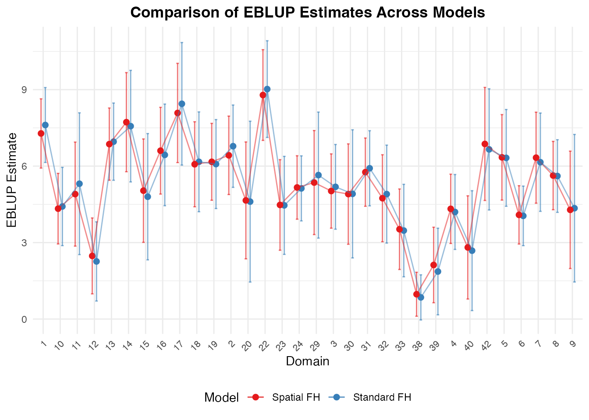

# Spatial and Spatio-Temporal Models

## Overview

When small areas are geographic units (such as counties, regencies, or
districts), spatial correlation frequently occurs: neighboring areas
tend to have more similar outcomes than distant ones. Furthermore, when
surveys are repeated over multiple years, temporal correlation between
time periods is also present.

**fastsae** provides specialized, high-performance implementations for
both: 1. **Spatial Fay-Herriot (`eblup_sfh`)**: Simultaneous
Autoregressive SAR(1) random effects. 2. **Spatio-Temporal Fay-Herriot
(`eblup_stfh`)**: Combined spatial SAR(1) and temporal AR(1) random
effects.

------------------------------------------------------------------------

## 1. Spatial Fay-Herriot Model (`eblup_sfh`)

### Model Formulation

The Spatial Fay-Herriot model (Pratesi & Salvati, 2008) models area
random effects using a Simultaneous Autoregressive (SAR(1)) process:

``` math
y = X\beta + u + e
```

``` math
u = \rho_1 W u + \epsilon_1 \implies u = (I - \rho_1 W)^{-1} \epsilon_1
```

where: - $`W`$ is a known row-standardized spatial proximity matrix
($`D \times D`$). - $`\rho_1 \in (-1, 1)`$ is the spatial autoregressive
parameter. - $`\epsilon_1 \sim N(0, \sigma_{u1}^2 I_D)`$ is independent
innovation noise. - $`e \sim N(0, V_e)`$ is sampling error with diagonal
matrix $`V_e = \text{diag}(D_1, \dots, D_D)`$.

### Fitting the Model

\
[`library`](https://rdrr.io/r/base/library.html)`(`[`fastsae`](https://ridsonap.github.io/fastsae)`)`\
[`data`](https://rdrr.io/r/utils/data.html)`(``"mys"``)`\
[`data`](https://rdrr.io/r/utils/data.html)`(``"mys_proxmat"``)`\
\
`# Fit Spatial Fay-Herriot model with REML`\
`fit_sfh`` ``<-`` `[`eblup_sfh`](https://ridsonap.github.io/fastsae/reference/eblup_sfh.md)`(`\
`  formula ``=`` ``y`` ``~`` ``x1`` ``+`` ``x2`` ``+`` ``x3``,`\
`  vardir  ``=`` ``~``vardir``,`\
`  data    ``=`` ``mys``,`\
`  W       ``=`` ``mys_proxmat``,`\
`  method  ``=`` ``"REML"``,`\
`  print_result ``=`` ``FALSE`\
`)`\
\
[`summary`](https://rdrr.io/r/base/summary.html)`(``fit_sfh``)`\
`#> `\
`#> ``──`` ``Summary of fastsae Fit`` ``──────────────────────────────────────────────────────`\
`#> Call :`\
`#> eblup_sfh(formula = y ~ x1 + x2 + x3, vardir = ~vardir, data = mys, method =`\
`#> "REML", W = mys_proxmat, print_result = FALSE)`\
`#> `\
`#> ``✔`` Convergence: Yes (in 8 iterations)`\
`#> ``Model``: Spatial Fay-Herriot (Area-level SAR)`\
`#> ``Method``: REML`\
`#> `\
`#> Variance & Correlation Components:`\
`#>  parameter  estimate std.error`\
`#>   sigma2_u  1.493692  1.095052`\
`#>        rho -1.000000 10.836726`\
`#> `\
`#> Coefficients:`\
`#>                    beta   std.error      zvalue pvalue`\
`#> (Intercept)  3.03659649  0.62669962  4.84537788 0.0000`\
`#> x1          -0.00085935  0.00824230 -0.10426151 0.9170`\
`#> x2           0.04983809  0.05273618  0.94504545 0.3446`\
`#> x3           0.03929798  0.05006522  0.78493574 0.4325`\
`#> `\
`#> Goodness of Fit:`\
`#> loglikelihood           AIC           BIC `\
`#>     -65.02194     142.04389     150.83830 `\
`#> `\
`#> EBLUP Summary Statistics:`\
`#>      eblup             mse              rse        `\
`#>  Min.   :0.9736   Min.   :0.1936   Min.   : 9.512  `\
`#>  1st Qu.:4.1867   1st Qu.:0.5725   1st Qu.:13.224  `\
`#>  Median :4.9636   Median :0.8264   Median :19.840  `\
`#>  Mean   :5.0375   Mean   :1.0470   Mean   :21.974  `\
`#>  3rd Qu.:6.1456   3rd Qu.:1.3772   3rd Qu.:30.137  `\
`#>  Max.   :8.7887   Max.   :2.3507   Max.   :45.188`

### Unsampled Domains and Spatial Kriging

A major advantage of `eblup_sfh` in **fastsae** is its automatic
handling of unsampled domains (domains with `y = NA`). Instead of
throwing an error or requiring manual subsetting, `eblup_sfh`
automatically performs **full-spatial kriging**:

\
`# Count sampled vs unsampled domains`\
[`table`](https://rdrr.io/r/base/table.html)`(`[`is.na`](https://rdrr.io/r/base/NA.html)`(``mys``$``y``)``)`\
`#> `\
`#> FALSE  TRUE `\
`#>    32    10`\
\
`# Inspect estimates for unsampled domains`\
[`head`](https://rdrr.io/r/utils/head.html)`(``fit_sfh``$``df_eblup``[`[`is.na`](https://rdrr.io/r/base/NA.html)`(``mys``$``y``)``, ``]``)`\
`#>    domain  y vardir    eblup random_effect      mse      rse`\
`#> 21     21 NA      0 3.660260             0 1.904961 37.70779`\
`#> 25     25 NA      0 4.153888             0 1.862352 32.85309`\
`#> 26     26 NA      0 5.305132             0 2.206307 27.99863`\
`#> 27     27 NA      0 4.300605             0 1.872941 31.82237`\
`#> 28     28 NA      0 5.039354             0 1.824374 26.80292`\
`#> 34     34 NA      0 3.491430             0 1.853401 38.99253`

For unsampled areas, prediction borrows strength from both the
regression synthetic component $`x_d^\top \hat{\beta}`$ and spatial
proximity to neighboring sampled areas through
$`(I - \hat{\rho}_1 W)^{-1}`$.

### Multi-Threaded Bootstrap MSE

In addition to analytical Prasad-Rao style MSE, `eblup_sfh` supports
multi-threaded OpenMP bootstrap MSE estimation:

- **Parametric Bootstrap (`mse_method = "pbmse"`)**
- **Non-Parametric Bootstrap (`mse_method = "npbmse"`)**

\
`fit_sfh_pb`` ``<-`` `[`eblup_sfh`](https://ridsonap.github.io/fastsae/reference/eblup_sfh.md)`(`\
`  formula    ``=`` ``y`` ``~`` ``x1`` ``+`` ``x2`` ``+`` ``x3``,`\
`  vardir     ``=`` ``~``vardir``,`\
`  data       ``=`` ``mys``,`\
`  W          ``=`` ``mys_proxmat``,`\
`  mse_method ``=`` ``"pbmse"``,`\
`  B          ``=`` ``50``,`\
`  n_threads  ``=`` ``2``,`\
`  seed       ``=`` ``123``,`\
`  print_result ``=`` ``FALSE`\
`)`\
`#> ``ℹ`` 10 unsampled domain(s) detected. Bootstrap MSE (pbmse) is computed for the 32 sampled domain(s); unsampled domain(s) get a full-spatial synthetic (kriging) prediction and analytical MSE instead.`\
\
[`head`](https://rdrr.io/r/utils/head.html)`(``fit_sfh_pb``$``df_eblup``[``, `[`c`](https://rdrr.io/r/base/c.html)`(``"domain"``, ``"y"``, ``"eblup"``, ``"mse"``, ``"mse_pb"``, ``"mse_pbbc"``)``]``)`\
`#>   domain        y    eblup       mse    mse_pb  mse_pbbc`\
`#> 1      1 8.359527 7.282308 0.4797992 0.5043246 0.6019482`\
`#> 2      2 7.599650 6.423856 0.6156692 0.4362874 0.6860557`\
`#> 3      3 5.514137 5.023421 0.5519476 0.6400385 0.7173447`\
`#> 4      4 3.869326 4.324716 0.4811841 0.4962733 0.5593804`\
`#> 5      5 6.305063 6.344991 0.7315241 0.5816691 0.8868638`\
`#> 6      6 3.926807 4.087497 0.3403445 0.4636404 0.3729264`

------------------------------------------------------------------------

## 2. Spatio-Temporal Fay-Herriot Model (`eblup_stfh`)

### Model Formulation

The Spatio-Temporal model (Marhuenda, Molina, & Morales, 2013) combines
spatial correlation and temporal autoregression across a balanced panel
of $`D`$ areas observed over $`T`$ time periods:

``` math
y_{dt} = x_{dt}^\top \beta + u_{1d} + u_{2dt} + e_{dt}
```

where: - $`u_1 = (u_{11}, \dots, u_{1D})^\top`$ captures static spatial
effects: $`u_1 = \rho_1 W u_1 + \epsilon_1`$. -
$`u_{2d} = (u_{2d1}, \dots, u_{2dT})^\top`$ captures dynamic temporal
effects for area $`d`$:
$`u_{2dt} = \rho_2 u_{2d,t-1} + \epsilon_{2dt}`$. -
$`e_{dt} \sim \text{ind. } N(0, D_{dt})`$ are sampling errors.

### Fitting the Spatio-Temporal Model

\
[`data`](https://rdrr.io/r/utils/data.html)`(``"mys_panel"``)`\
\
`# Prepare balanced panel without missing values`\
`panel_data`` ``<-`` ``mys_panel``[``!`[`is.na`](https://rdrr.io/r/base/NA.html)`(``mys_panel``$``y``)`` ``&`` ``mys_panel``$``year`` ``>=`` ``2024``, ``]`\
`W_sub`` ``<-`` ``mys_proxmat``[``-`[`c`](https://rdrr.io/r/base/c.html)`(``21``, ``25``)``, ``-`[`c`](https://rdrr.io/r/base/c.html)`(``21``, ``25``)``]`\
\
`# Fit Spatio-Temporal model with bootstrap MSE`\
`fit_stfh`` ``<-`` `[`eblup_stfh`](https://ridsonap.github.io/fastsae/reference/eblup_stfh.md)`(`\
`  formula     ``=`` ``y`` ``~`` ``x1`` ``+`` ``x2`` ``+`` ``x3``,`\
`  data        ``=`` ``panel_data``,`\
`  vardir      ``=`` ``~``vardir``,`\
`  domain      ``=`` ``~``area``,`\
`  time        ``=`` ``~``year``,`\
`  W           ``=`` ``W_sub``,`\
`  model       ``=`` ``"ST"``,`\
`  compute_mse ``=`` ``TRUE``,`\
`  B           ``=`` ``25``,`\
`  seed        ``=`` ``42``,`\
`  print_result ``=`` ``FALSE`\
`)`\
\
[`summary`](https://rdrr.io/r/base/summary.html)`(``fit_stfh``)`\
`#> `\
`#> ``──`` ``Summary of fastsae Fit`` ``──────────────────────────────────────────────────────`\
`#> Call :`\
`#> eblup_stfh(formula = y ~ x1 + x2 + x3, vardir = ~vardir, data = panel_data,`\
`#> domain = ~area, time = ~year, W = W_sub, model = "ST", compute_mse = TRUE, B =`\
`#> 25, seed = 42, print_result = FALSE)`\
`#> `\
`#> ``✔`` Convergence: Yes (in 12 iterations)`\
`#> ``Model``: Spatio-Temporal Fay-Herriot (ST-FH)`\
`#> ``Method``: REML`\
`#> `\
`#> Variance & Correlation Components:`\
`#>    estimate  std.error`\
`#>   0.0000000  3.3656683`\
`#>  -0.9990000 10.2860936`\
`#>   2.2451375  0.7260280`\
`#>   0.5738458  0.4727148`\
`#> `\
`#> Coefficients:`\
`#>                   beta  std.error     zvalue pvalue`\
`#> (Intercept)  3.7498891  0.4538487  8.2624211 0.0000`\
`#> x1          -0.0053032  0.0046392 -1.1431391 0.2530`\
`#> x2           0.0606926  0.0258702  2.3460387 0.0190`\
`#> x3           0.0173309  0.0257334  0.6734780 0.5006`\
`#> `\
`#> Goodness of Fit:`\
`#>   loglike       AIC       BIC `\
`#> -243.6043  503.2087  525.5086 `\
`#> `\
`#> EBLUP Summary Statistics:`\
`#>      eblup             mse              rse         `\
`#>  Min.   :-0.729   Min.   :0.1885   Min.   :  7.866  `\
`#>  1st Qu.: 4.661   1st Qu.:0.5410   1st Qu.: 12.858  `\
`#>  Median : 5.465   Median :0.7642   Median : 15.707  `\
`#>  Mean   : 5.424   Mean   :0.8911   Mean   : 20.922  `\
`#>  3rd Qu.: 6.244   3rd Qu.:1.0287   3rd Qu.: 19.913  `\
`#>  Max.   : 9.203   Max.   :3.2885   Max.   :276.605`

The estimated variance and correlation components include: - `sigma21`:
Spatial random effect variance ($`\sigma_{u1}^2`$). - `rho1`: Spatial
autocorrelation ($`\rho_1`$). - `sigma22`: Temporal random effect
variance ($`\sigma_{u2}^2`$). - `rho2`: Temporal AR(1) autoregression
coefficient ($`\rho_2`$).

------------------------------------------------------------------------

## 3. Comparing Models with `autoplot`

You can directly compare EBLUP estimates and uncertainty across
different models using
[`autoplot()`](https://ggplot2.tidyverse.org/reference/autoplot.html):

\
`# Compare Fay-Herriot vs Spatial Fay-Herriot`\
`fit_fh`` ``<-`` `[`eblup_fh`](https://ridsonap.github.io/fastsae/reference/eblup_fh.md)`(``y`` ``~`` ``x1`` ``+`` ``x2`` ``+`` ``x3``, vardir ``=`` ``~``vardir``, data ``=`` `[`na.omit`](https://rdrr.io/r/stats/na.fail.html)`(``mys``)``, print_result ``=`` ``FALSE``)`\
`W_clean`` ``<-`` ``mys_proxmat``[``!`[`is.na`](https://rdrr.io/r/base/NA.html)`(``mys``$``y``)``, ``!`[`is.na`](https://rdrr.io/r/base/NA.html)`(``mys``$``y``)``]`\
`fit_sfh_clean`` ``<-`` `[`eblup_sfh`](https://ridsonap.github.io/fastsae/reference/eblup_sfh.md)`(``y`` ``~`` ``x1`` ``+`` ``x2`` ``+`` ``x3``, vardir ``=`` ``~``vardir``, data ``=`` `[`na.omit`](https://rdrr.io/r/stats/na.fail.html)`(``mys``)``, W ``=`` ``W_clean``, print_result ``=`` ``FALSE``)`\
\
[`autoplot`](https://ggplot2.tidyverse.org/reference/autoplot.html)`(`[`list`](https://rdrr.io/r/base/list.html)`(``"Standard FH"`` ``=`` ``fit_fh``, ``"Spatial FH"`` ``=`` ``fit_sfh_clean``)``, type ``=`` ``"comparison"``)`



## References

- Marhuenda, Y., Molina, I., & Morales, D. (2013). Small area estimation
  with spatio-temporal Fay-Herriot models. *Computational Statistics &
  Data Analysis*, 58, 308–325.
- Pratesi, M., & Salvati, N. (2008). Small area estimation for spatially
  correlated data: A Fay-Herriot with the spatial linear spline model.
  *Journal of Applied Statistics*, 35(7), 781–794.
