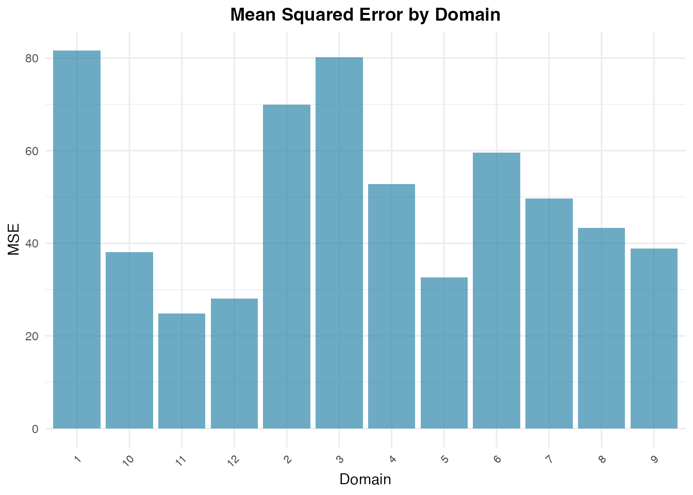
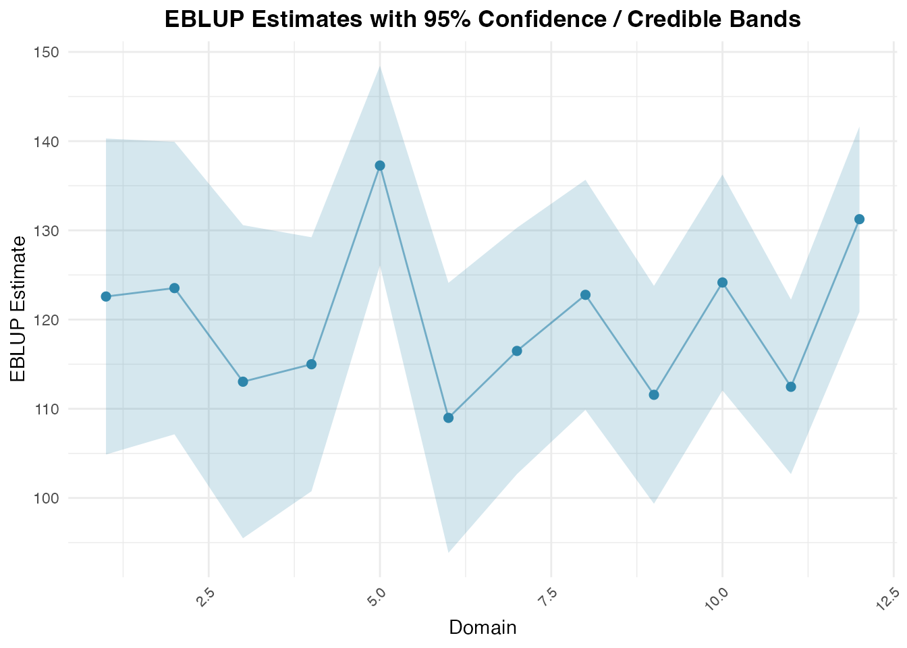

# Unit-Level Estimation with Battese-Harter-Fuller

## Overview

Unlike area-level models that aggregate data prior to modeling,
**unit-level models** operate directly on individual survey unit records
(e.g., households, farms, or persons) while linking them to population
auxiliary aggregates (e.g., census means or satellite imagery).

The **fastsae** package implements the nested error regression model of
Battese, Harter, and Fuller (1988) via
[`eblup_bhf()`](https://ridsonap.github.io/fastsae/reference/eblup_bhf.md),
providing fast estimation and parallel parametric bootstrap MSE.

------------------------------------------------------------------------

## Model Formulation

For individual unit $`j`$ ($`j = 1, \dots, n_d`$) in small area $`d`$
($`d = 1, \dots, D`$):

``` math
y_{dj} = x_{dj}^\top \beta + u_d + e_{dj}
```

where: - $`u_d \sim \text{i.i.d. } N(0, \sigma_u^2)`$ is the
area-specific random effect. -
$`e_{dj} \sim \text{i.i.d. } N(0, \sigma_e^2)`$ is the unit-level error
variance. - $`u_d`$ and $`e_{dj}`$ are mutually independent.

The small area population mean $`\bar{Y}_d`$ is estimated by:

``` math
\hat{\bar{Y}}_d^{\text{EBLUP}} = \bar{X}_d^\top \hat{\beta} + \gamma_d (\bar{y}_d - \bar{x}_d^\top \hat{\beta})
```

where: - $`\bar{X}_d`$ is the known population mean vector of auxiliary
variables for domain $`d`$. - $`\bar{y}_d`$ and $`\bar{x}_d`$ are the
sample means for domain $`d`$. -
$`\gamma_d = \frac{\sigma_u^2}{\sigma_u^2 + \sigma_e^2 / n_d}`$ is the
shrinkage ratio.

------------------------------------------------------------------------

## Step-by-Step Example

### 1. Data Preparation

We use the classic `cornsoybean` dataset, reporting corn crop hectares
per segment in 12 Iowa counties:

\
[`library`](https://rdrr.io/r/base/library.html)`(`[`fastsae`](https://ridsonap.github.io/fastsae/)`)`\
[`data`](https://rdrr.io/r/utils/data.html)`(``"cornsoybean"``)`\
[`data`](https://rdrr.io/r/utils/data.html)`(``"cornsoybeanmeans"``)`\
\
`# Align column names for population auxiliary means`\
`df_pop`` ``<-`` ``cornsoybeanmeans`\
[`names`](https://rdrr.io/r/base/names.html)`(``df_pop``)``[`[`names`](https://rdrr.io/r/base/names.html)`(``df_pop``)`` ``==`` ``"MeanCornPixPerSeg"``]`` ``<-`` ``"CornPix"`\
[`names`](https://rdrr.io/r/base/names.html)`(``df_pop``)``[`[`names`](https://rdrr.io/r/base/names.html)`(``df_pop``)`` ``==`` ``"MeanSoyBeansPixPerSeg"``]`` ``<-`` ``"SoyBeansPix"`\
[`names`](https://rdrr.io/r/base/names.html)`(``df_pop``)``[`[`names`](https://rdrr.io/r/base/names.html)`(``df_pop``)`` ``==`` ``"CountyIndex"``]`` ``<-`` ``"County"`\
\
[`head`](https://rdrr.io/r/utils/head.html)`(``cornsoybean``)`\
`#>   County CornHec SoyBeansHec CornPix SoyBeansPix`\
`#> 1      1  165.76        8.09     374          55`\
`#> 2      2   96.32      106.03     209         218`\
`#> 3      3   76.08      103.60     253         250`\
`#> 4      4  185.35        6.47     432          96`\
`#> 5      4  116.43       63.82     367         178`\
`#> 6      5  162.08       43.50     361         137`\
[`head`](https://rdrr.io/r/utils/head.html)`(``df_pop``)`\
`#>   County CountyName SampSegments PopnSegments CornPix SoyBeansPix`\
`#> 1      1 CerroGordo            1          545  295.29      189.70`\
`#> 2      2   Hamilton            1          566  300.40      196.65`\
`#> 3      3      Worth            1          394  289.60      205.28`\
`#> 4      4   Humboldt            2          424  290.74      220.22`\
`#> 5      5   Franklin            3          564  318.21      188.06`\
`#> 6      6 Pocahontas            3          570  257.17      247.13`

### 2. Fit BHF Model with Bootstrap MSE

We fit the model using
[`eblup_bhf()`](https://ridsonap.github.io/fastsae/reference/eblup_bhf.md).
To estimate domain-level Mean Squared Error (MSE), set
`compute_mse = TRUE`:

\
`fit_bhf`` ``<-`` `[`eblup_bhf`](https://ridsonap.github.io/fastsae/reference/eblup_bhf.md)`(`\
`  formula ``=`` ``CornHec`` ``~`` ``CornPix`` ``+`` ``SoyBeansPix``,`\
`  unit_data ``=`` ``cornsoybean``,`\
`  Xpop ``=`` ``df_pop``,`\
`  domain_var ``=`` ``"County"``,`\
`  popsize_var ``=`` ``"PopnSegments"``,`\
`  method ``=`` ``"REML"``,`\
`  compute_mse ``=`` ``TRUE``,`\
`  B ``=`` ``50``,`\
`  seed ``=`` ``123``,`\
`  print_result ``=`` ``FALSE`\
`)`\
`#> boundary (singular) fit: see help('isSingular')`\
`#> boundary (singular) fit: see help('isSingular')`\
`#> boundary (singular) fit: see help('isSingular')`\
`#> boundary (singular) fit: see help('isSingular')`\
`#> boundary (singular) fit: see help('isSingular')`\
\
[`summary`](https://rdrr.io/r/base/summary.html)`(``fit_bhf``)`\
`#> `\
`#> ``──`` ``Summary of fastsae Fit`` ``──────────────────────────────────────────────────────`\
`#> Call :`\
`#> eblup_bhf(formula = CornHec ~ CornPix + SoyBeansPix, unit_data = cornsoybean,`\
`#> Xpop = df_pop, domain_var = "County", popsize_var = "PopnSegments", method =`\
`#> "REML", B = 50, compute_mse = TRUE, seed = 123, print_result = FALSE)`\
`#> `\
`#> ``✔`` Convergence: Yes (in - iterations)`\
`#> ``Model``: Battese-Harter-Fuller (Unit-level)`\
`#> `\
`#> Variance Components:`\
`#> sigma2_u: 63.3149 `\
`#> `\
`#> Coefficients:`\
`#>                  beta std.error    zvalue pvalue`\
`#> (Intercept) 17.963979 30.974505  0.579960 0.5619`\
`#> CornPix      0.366335  0.064959  5.639511 0.0000`\
`#> SoyBeansPix -0.030364  0.067576 -0.449327 0.6532`\
`#> `\
`#> EBLUP Summary Statistics:`\
`#>       mse             rse       `\
`#>  Min.   :24.89   Min.   :4.039  `\
`#>  1st Qu.:36.74   1st Qu.:4.838  `\
`#>  Median :46.45   Median :5.816  `\
`#>  Mean   :49.96   Mean   :5.839  `\
`#>  3rd Qu.:62.20   3rd Qu.:6.849  `\
`#>  Max.   :81.65   Max.   :7.921`

### 3. Inspect Domain Estimates

The resulting `df_eblup` data frame contains the domain estimates along
with sample size, MSE, and Relative Standard Error (RSE):

\
[`head`](https://rdrr.io/r/utils/head.html)`(``fit_bhf``$``df_eblup``)`\
`#>   domain    eblup samp_size      mse      rse`\
`#> 1      1 122.5825         1 81.64650 7.371235`\
`#> 2      2 123.5274         1 69.94384 6.770354`\
`#> 3      3 113.0343         1 80.17283 7.921429`\
`#> 4      4 114.9901         2 52.75789 6.316599`\
`#> 5      5 137.2660         3 32.60240 4.159698`\
`#> 6      6 108.9807         3 59.61422 7.084763`

### 4. Visualizing Results with `autoplot`

For unit-level models, domain uncertainty and model comparisons can be
displayed with
[`autoplot()`](https://ggplot2.tidyverse.org/reference/autoplot.html):

\
`# Plot MSE across counties`\
[`autoplot`](https://ggplot2.tidyverse.org/reference/autoplot.html)`(``fit_bhf``, type ``=`` ``"mse"``)`



\
\
`# Plot EBLUP estimates with confidence intervals`\
[`autoplot`](https://ggplot2.tidyverse.org/reference/autoplot.html)`(``fit_bhf``, type ``=`` ``"comparison"``)`



## References

- Battese, G. E., Harter, R. M., & Fuller, W. A. (1988). An
  error-components model for prediction of county crop areas using
  survey and satellite data. *Journal of the American Statistical
  Association*, 83(401), 28–36.
- Rao, J. N. K., & Molina, I. (2015). *Small Area Estimation* (2nd ed.).
  John Wiley & Sons.
