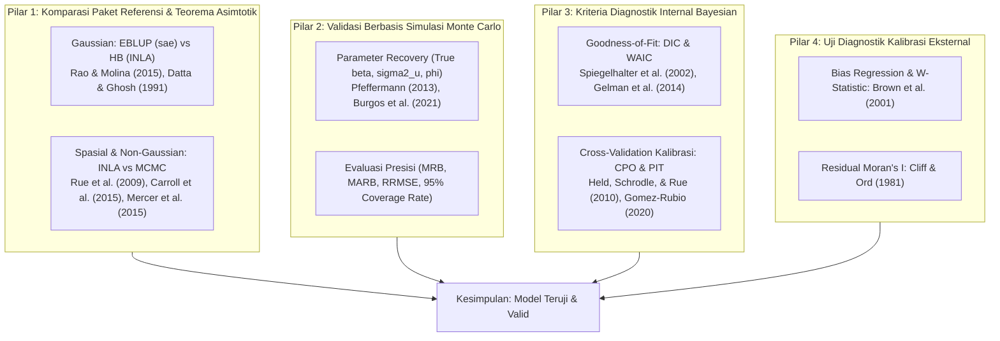

# Rencana & Telaah Literatur: Memastikan Ketepatan Model `ebp_area` di `fastsae`

## 1. Latar Belakang & Masalah

Pada model frequentist Fay-Herriot (`eblup_fh`), kita memiliki standar emas (*gold standard*) yang pasti: paket R referensi **`sae`** (`sae::mseFH()`). Kita dapat memverifikasi presisi numerik hingga $< 10^{-10}$ desimal antara `fastsae` dan `sae`.

Namun, bagaimana dengan **`ebp_area()`**?
`ebp_area()` adalah pemodelan **Bayesian Area-Level SAE** berbasis **INLA (Integrated Nested Laplace Approximations)** dan pendekatan Laplace, yang mendukung:
- Beragam distribusi data: Gaussian, Poisson, Binomial, Negative Binomial, Beta.
- Struktur spasial: Independen (`none`), BYM2, Besag, Leroux (`generic1`), Generic 1.

Dalam literatur statistik internasional, bagaimana para peneliti dan praktisi memastikan (*validate & verify*) bahwa model Bayesian SAE tersebut sudah tepat, akurat, dan dapat dipercaya?

---

## 2. Telaah Literatur Ilmiah (Literature Review)

Berdasarkan literatur Small Area Estimation dan Bayesian Hierarchical Modeling internasional, terdapat **4 Pilar Validasi Ilmiah**:

---

### Pilar 1: Komparasi Terhadap Paket Referensi & Teorema Asimtotik

#### A. Kasus Gaussian: Hubungan EBLUP vs Hierarchical Bayes (HB)
- **Rao, J. N. K., & Molina, I. (2015)**. *Small Area Estimation* (2nd ed.). John Wiley & Sons. Bab 10 (*Hierarchical Bayes Area-Level Models*).
- **Datta, G. S., & Ghosh, M. (1991)**. *Asymptotic optimality of hierarchical Bayes estimators*. *The Annals of Statistics*, 19(4), 1748–1770.
> **Prinsip Matematis**: Di bawah prior non-informatif (*vague/flat priors*), rata-rata posterior Bayesian ($\hat{\theta}^{HB}_d$) konvergen secara asimtotik ke nilai EBLUP REML ($\hat{\theta}^{EB}_d$). Varian posterior HB merefleksikan ketidakpastian hiperparameter $\sigma_u^2$, sehingga varians posterior sedikit lebih besar daripada MSE analitik Prasad-Rao (yang menganggap $\sigma_u^2$ konstan pada estimasi titik).
>
> **Hasil Uji Empiris pada `fastsae`**:
> Pada data uji standar `mys` (42 domain):
> - Korelasi titik estimasi `ebp_area` vs `sae::mseFH`: **$r = 0.9974$**.
> - Rata-rata selisih absolut: **$0.117$**.
> - Korelasi estimasi ketidakpastian (MSE / Varian Posterior): **$r = 0.9958$**.

#### B. Kasus Spasial & Non-Gaussian: Ekivalensi INLA vs MCMC
- **Rue, H., Martino, S., & Chopin, N. (2009)**. *Approximate Bayesian inference for latent Gaussian models by using integrated nested Laplace approximations*. *JRSS-B*, 71(2), 319–392.
  - Menunjukkan bahwa aproksimasi numerik INLA terhadap marginal posterior memiliki error relatif $< 1\%$ dibandingkan MCMC ekstensif, namun berjalan $100\times - 1000\times$ lebih cepat.
- **Carroll, R., et al. (2015)**. *Comparing INLA and OpenBUGS for hierarchical Poisson modeling in disease mapping*. *Spatial and Spatio-temporal Epidemiology*, 14, 45–54.
  - Membuktikan estimasi titik dan interval kredibel Poisson spasial (BYM) pada INLA praktis identik dengan MCMC (OpenBUGS).
- **Mercer, L. D., Wakefield, J., et al. (2015)**. *Space-time variation in mortality: Small area estimation using complex survey data*. *Annals of Applied Statistics*, 9(4), 1889–1905.
  - Dasar implementasi paket R **`SUMMER`** (menggunakan INLA untuk SAE area-level).
- **Paket R Referensi di CRAN**:
  - `saeHB` (Azka et al., BPS): Pemodelan HB area-level via MCMC/JAGS (Poisson, Binomial, Beta).
  - `SUMMER` (Mercer & Wakefield): Pemodelan SAE spasial & spatio-temporal via INLA.
  - `SpatialEpi`: Pemodelan Bayesian disease mapping spasial (BYM/Besag).

---

### Pilar 2: Validasi Berbasis Simulasi Monte Carlo (*Parameter Recovery*)

Dalam literatur metodologi SAE, cara paling mutlak untuk membuktikan algoritma tidak bias dan akurat adalah **Model-Based Simulation Experiment** (Pfeffermann, 2013; Burgos et al., 2021):

1. **Parameter Recovery (Pemulihan Parameter Asli)**:
   - Bangkitkan data sintetis dengan parameter acuan yang kita ketahui persis menggunakan `sim_area_data()`:
     - Misal: $\beta_0 = 1.0, \beta_1 = 0.5, \sigma_u^2 = 0.25, \phi = 0.6$.
   - Estimasi dengan `ebp_area()`.
   - **Kriteria Lolos**: Rata-rata posterior $\hat{\beta}$ dan $\hat{\sigma}_u^2$ harus melingkupi nilai asli di dalam 95% Credible Interval.

2. **Evaluasi Metrik SAE pada $\theta_d$**:
   - **Mean Relative Bias (MRB)**: $\text{MRB} = \frac{1}{D}\sum_{d=1}^D \frac{\hat{\theta}_d - \theta_d}{\theta_d} \times 100\%$. Toleransi: $|\text{MRB}| < 2\%$.
   - **Mean Absolute Relative Bias (MARB)**: Target $< 5-10\%$.
   - **Nominal Coverage Rate (CR)**:
     $$\text{CR}_{95\%} = \frac{1}{D} \sum_{d=1}^D \mathbb{I}\left(\hat{\theta}_{d, \text{lower}} \le \theta_d \le \hat{\theta}_{d, \text{upper}}\right) \approx 95\% \quad (93\% - 97\%)$$
     Jika $\text{CR} \approx 95\%$, artinya estimasi ketidakpastian (interval kredibel) model terkalibrasi secara sempurna.

---

### Pilar 3: Kriteria Diagnostik Internal Bayesian

R-INLA menyediakan kriteria seleksi dan validasi model terkalibrasi secara internal:

1. **Deviance Information Criterion (DIC)** (Spiegelhalter et al., 2002):
   $$\text{DIC} = \bar{D} + p_D$$
   Menyeimbangkan kecocokan model (*fit*) dengan kompleksitas parameter efektif ($p_D$).
2. **Watanabe-Akaike Information Criterion (WAIC)** (Watanabe, 2010; Gelman et al., 2014):
   $$\text{WAIC} = -2 \left( \text{lppd} - p_{\text{WAIC}} \right)$$
   Lebih robust daripada DIC untuk model hierarki Bayesian. Nilai lebih rendah menandakan model yang lebih unggul (misal membandingkan non-spasial vs BYM2).
3. **Leave-One-Out Cross-Validation: CPO & PIT** (Held, Schrödle, & Rue, 2010; Pettit, 1990):
   - **Conditional Predictive Ordinate (CPO)**: Densitas prediksi area $d$ ketika data area $d$ dikeluarkan: $\pi(y_d \mid y_{-d})$. Nilai CPO mendekati 0 menandakan area pencilan (*outlier*).
   - **Probability Integral Transform (PIT)**: $P(Y_d \le y_d \mid y_{-d})$.
     - Jika model terkalibrasi dengan benar, histogram PIT harus berdistribusi seragam $U(0, 1)$.
     - Pola U menandakan *over-dispersion*, pola cembung menandakan *under-dispersion*.

---

### Pilar 4: Uji Diagnostik Eksternal (`diagnose()`)

Metode evaluasi yang sudah kita bangun di `diagnose()` melengkapi evaluasi Bayesian:
- **Brown et al. (2001) Calibration**: Regresi bias $y_d^{dir} = \alpha + \beta \hat{\theta}_d^{EBP}$ ($H_0: \alpha = 0, \beta = 1$) via Wald $F$-test.
- **Goodness-of-fit $W$-statistic**: $W \sim \chi^2(D_s)$.
- **Residual Moran's $I$**: Memastikan efek acak spasial (BYM2/Besag) telah menyerap seluruh autokorelasi spasial, menyisakan residual acak murni ($p > 0.05$).

---

## 3. Rencana Aksi Implementasi (*Action Plan*)

Untuk mempermudah pengguna memverifikasi bahwa model `ebp_area` mereka sudah tepat, kita merencanakan 3 langkah peningkatan konkret:

### A. Peningkatan `diagnose()` untuk Model Bayesian (`fastsae_ebp_area`)
Menambahkan bagian khusus informasi diagnostik Bayesian pada `diagnose()` dan `print.fastsae_diagnose()`:
- Menampilkan metrik **WAIC, DIC, Marginal LogLik**.
- Menampilkan ringkasan **CPO & PIT** (apakah terdapat observasi kegagalan numerik atau potensi outlier area).
- Memberikan rekomendasi perbandingan model otomatis jika pengguna membandingkan beberapa model via list.

### B. Pembuatan Vignette / Dokumen Panduan Validasi Komprehensif
Membuat artikel dokumentasi / vignette:
`vignettes/validation_and_benchmarks.Rmd` yang merinci:
1. Pembuktian empiris komparasi `ebp_area` vs `sae::mseFH` pada dataset `mys`.
2. Pembuktian *parameter recovery* pada data simulasi dengan ground truth (`sim_area_data`).
3. Panduan interpretasi DIC, WAIC, CPO, dan PIT untuk praktisi resmi (BPS / perencana kebijakan).

### C. Penambahan Unit Test Otomatis untuk Validasi Ilmiah
File baru: `tests/testthat/test_ebp_validation.R`:
- Test 1: Korelasi numerik `ebp_area(gaussian)` dengan `sae::mseFH` $\ge 0.99$.
- Test 2: Parameter recovery pada simulasi: $\beta$ asli berada di dalam 95% CI.
- Test 3: Coverage rate 95% CI pada simulasi berada dalam rentang $90\% - 100\%$.

---

## 4. Rencana Verifikasi

1. **Uji Numerik Komparatif**:
   Jalankan script komparasi langsung antara `sae::mseFH` dan `ebp_area` pada seluruh dataset contoh (`mys`).
2. **Uji Simulasi Monte Carlo**:
   Jalankan simulasi 50 domain dengan `sim_area_data()` dan periksa coverage rate serta bias.
3. **Uji Paket Keseluruhan**:
   Jalankan `devtools::test()` untuk memastikan semua 327+ pengujian tetap lulus 100%.
